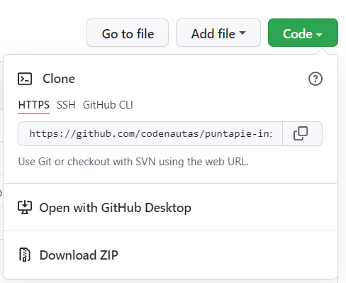

# puntapie-inicial

Puntapié inicial para hacer una aplicación en backend-plus desde cero (para generar una nueva app para operativos basarse en dmencu y en la app del último operativo)

# iniciar una aplicación nueva

Para mantener este módulo, actualizar versiones, mantener los tipos de ts ver las [instrucciones de mantenimeiento](docs/mantenimiento.md)

## requisitos para arrancar

Tener instalado:
   1. git (para windows [git-scm](https://git-scm.com/) y [TortoiseGit](https://tortoisegit.org/))
   2. [PostgreSQL](https://www.postgresql.org/) versión 12 como mínimo
   3. [nodejs](https://nodejs.org/es/) versión 14 como mínimo
   4. [Visual Studio Code](https://code.visualstudio.com/)

## arrancar con la cáscara

Elegir un nombre para el sistema (por ejemplo "nueva app"). 

Si se va a usar el git como repositorio (github, gitlab o lo que sea),
crear el repositorio y clonarlo en una carpeta. Pero no clonar puntapie-inicial. 
Si no generar una carpeta en blanco (o del repositorio que sea).

Bajar el `puntapie-inicial` (sin clonar ni hacer branch) en la carpeta del sistema nuevo. 

[](https://github.com/codenautas/puntapie-inicial/archive/refs/heads/master.zip)


Cambiar todas las ocurrencias de puntapie inicial por nueva app, 
respetando los guiones y rayas (- ó _) y las mayúsculas y minúsculas
(cómo dice en la sección [reemplazos](#reemplazos)). 
Eso debe hacerse tanto dentro de los archivos como en los nombres de los mismos. 

Copiar el archivo `example-local-config.yaml` en `local-config.yaml` 
y cambiar los parámetros necesarios (url, puertos, etc) .

## personalizarla

Los elementos para personalizarla son:
   1. El ícono de desarrollo 🏗 que está en `.vscode/settings.json "window-title"` 
   por cualquier otro [UNICODE](amp-what.com)
   2. La licencia (la que viene predeterminada es MIT) en el `package.json`
   3. El nombre, versión y título de la aplicación en `package.json` y el `README.MD`
   4. La gráfica en las carpetas `img` y `css` dentro de `src/unlogged` y `src/client` 
   5. Los usuarios inicials de prueba en `install/usuarios.tab`
   6. Las tablas de ejemplo hay que quitarlas y agregar las necesarias 
   (archivos y objetos cuyo nombre contiene la palabra `ejemplo`)
   7. Hay que corregir el menú
   8. Si no habrá página deslogueado:
      1. borrar `noLoggedUrlPath: /pub` del `local-config`
      2. borrar la funión `addUnloggedServices`
   9. Borrar los procedimientos y agregar los que se necesiten

## instalarla

```sh
npm install
npm start -- --dump-db
```
Eso generará dos archivos de dump para crear la base de datos vacía y para crear las tablas en postgres.

```sh
npm start
```

En el navegador ir a `localhost:3000/nueva_app` (o como se llame la aplicación). O a `localhost:3000/nueva_app/admin` 
para administrarla. 

## ejemplo

Al instalar se puede ver una aplicación de ejemplo que muestra noticias (con título, fecha, autor y uno o más vínculos),
tiene dos tipos de usuarios, el administrador y los redactores. El administrador puede hacer lo que quiera con los datos.
Los redactores pueden agregar y modificar noticias, y publicarlas. 
No pueden ver las noticias de otros redactores hasta que no estén publicadas. 

Las tablas y procedimientos de ejemplo hay que borrarlo para empezar con la aplicación limpia. 
Simplemente hay que buscar la palabra ejemplo en el código fuente (y en los nombres de los archivos) para elimianarlo. 

### remplazos

Usando VSCode se pueden usar *expresionres regulares* (case sensitive) para busacar `puntapie([-_]?)inicial` y reemplazar por `nueva$1app`. Y luego `Puntapie([-_]?)Inicial` y reemplazar por `Nueva$1App`. 

## documentación

Está en [github](https://github.com/codenautas/backend-plus/blob/master/LEEME.md)
